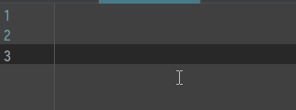

# 核心

1. 名字不是组成文件名的必须成分, uid 才是
2. 时间戳和序号具有重要的作用

# 重命名格式

- uid index: 2019-10-15 091530 (1).jpg
    - uid 使用时间戳, 一方面简化计算, 一方面利于阅读
    - uid 虽然是以时间戳形式表现, 但不负责指示真实的修改时间, 只负责该组图片的系列唯一性
- name index: 示例图片 (1).jpg
- name timestamp index: 示例图片 2019-10-15 091522 (1).jpg

# 重命名生成方式 (工具)

1. 输入法自定义短语, 以搜狗输入法为例: `id,2=#$year-$month_mm-$day_dd $fullhour_hh$minute$second`  
   
2. auto hotkey
3. pywinauto

# 关联文件

关联文件是指有联系的, 有顺序的一组图片.

关联文件采用统一的 prefix (uid/name), 以及顺序的编号 (index) 表示.
